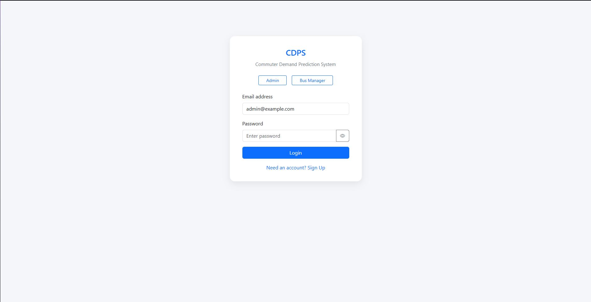
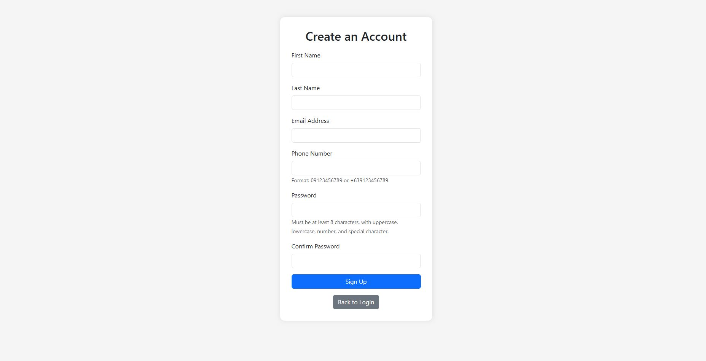
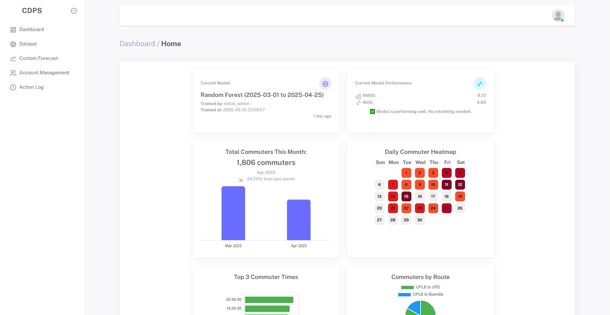
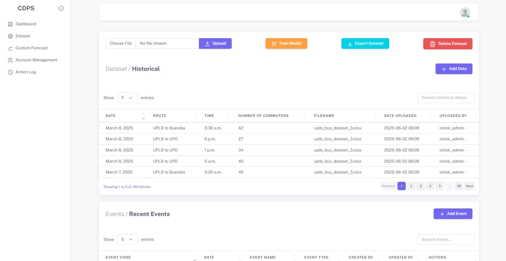
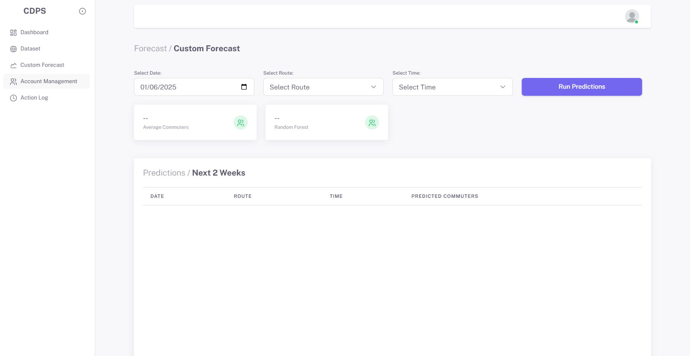
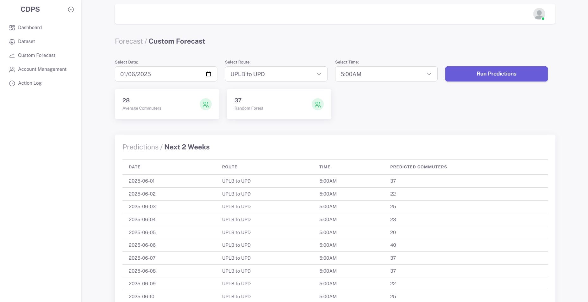
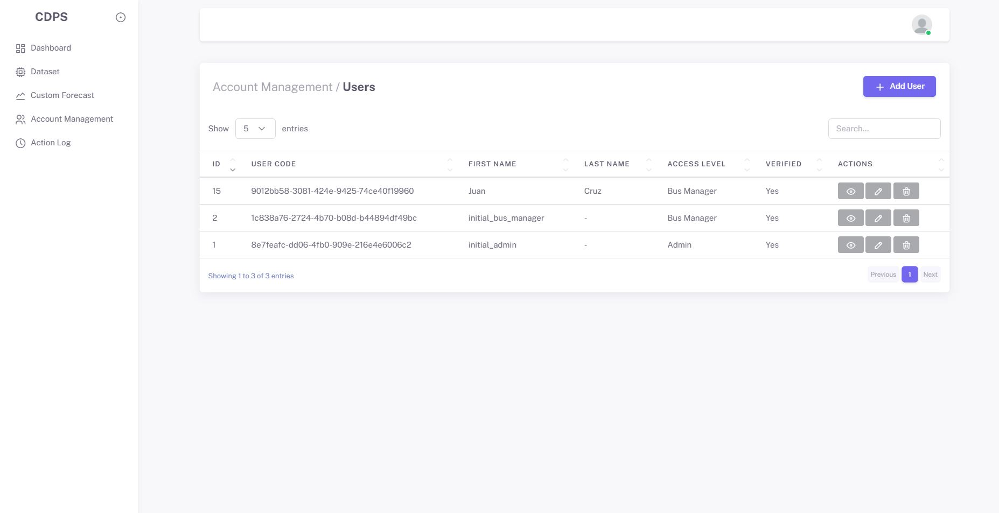
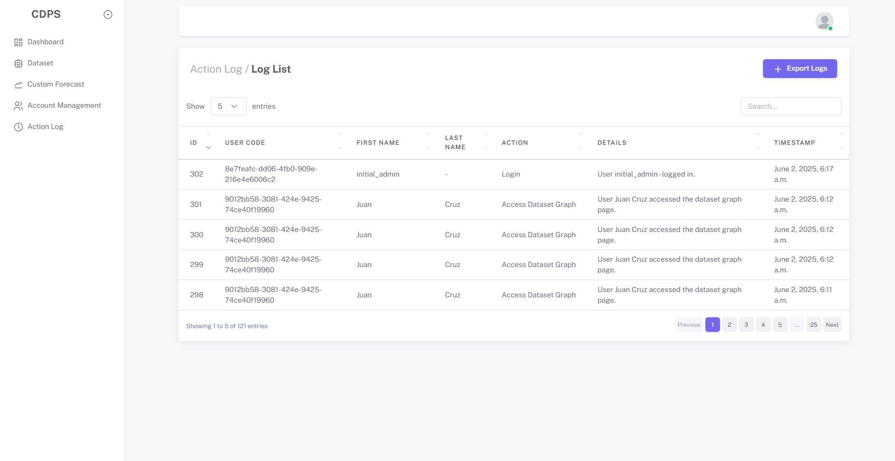
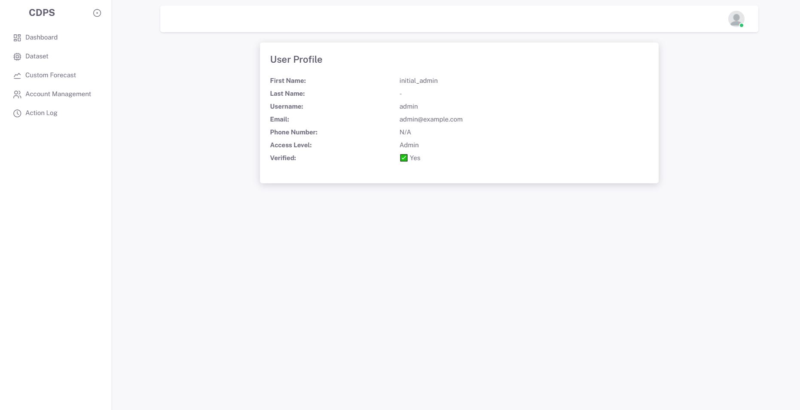
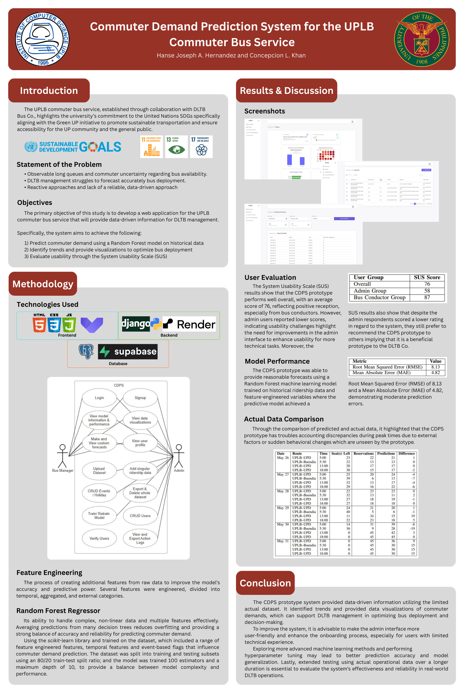

# 🚍 Commuter Demand Prediction System (CDPS) 🚍

A web-based prototype that leverages **machine learning (Random Forest)** to predict commuter demand for the UPLB Commuter Bus Service.  
Developed as part of my **undergraduate special problem ** at the **University of the Philippines Los Baños (UPLB)**.

---

##  Abstract
The **Commuter Demand Prediction System (CDPS)** was designed to support UPLB’s commuter bus service in **optimizing bus deployment and scheduling**.  
- Uses a **Random Forest Regressor** trained on historical ridership data.  
- Provides **interactive dashboards** for demand trends and predictions.  
- Achieved **~70% predictive accuracy** (MAPE = 29.57%).  
- Usability evaluation via the **System Usability Scale (SUS)** scored **76 (Grade B – Excellent)**.  

---

##  Key Features
### For Bus Managers
-  **Dashboard** with demand trends and model metrics  
-  **Custom forecasts** by date, time, and route  

### For Admins
-  **Dataset management** (upload new data, retrain model)  
-  **Account management** (create/edit/delete manager accounts)  
-  **Action logs** for monitoring activity  
-  **Secure login** for all users  

---

##  System Architecture
The CDPS follows a three-layer design:  
1. **Frontend (Presentation Layer):** HTML, CSS, JavaScript (Vuexy Bootstrap Template)  
2. **Backend (Application Layer):** Django (Python), deployed on Render  
3. **Data Layer:** PostgreSQL (commuter data, users, logs) + Supabase (ML model storage)  

---

##  Machine Learning Model
- **Algorithm:** Random Forest Regressor  
- **Features:** Temporal features (holidays, semester dates, events), aggregated ridership counts, external events  
- **Performance:**  
  - RMSE = **8.13**  
  - MAE = **4.82**  
  - MAPE = **29.57%** (~70% accuracy)  

---

##  Results
### Usability Testing (SUS)
- **Overall:** 76 (Grade B – Excellent)  
- **Bus Conductors:** 87 (A+ – Best imaginable)  
- **Admins:** 58 (D – Okay, needs improvements)  

### Model Performance
- Accurate for general trends  
- Struggled with **peak-time fluctuations** due to limited dataset (180 entries, March–April 2025)  

---

##  Screenshots

### Login Page

### Signup Page

### Dashboard Page

### Dataset Page

### Custom Forecast Page

### Account Management Page

### Action Log Page

### User Profile Page

---

##  Future Work
- Improve **admin interface** for ease of use  
- Add **weather and university events** as features  
- Explore **advanced ML models & hyperparameter tuning**  
- Automate with **real-time data sources**  
- Validate with **longer-term datasets** 

## Poster

